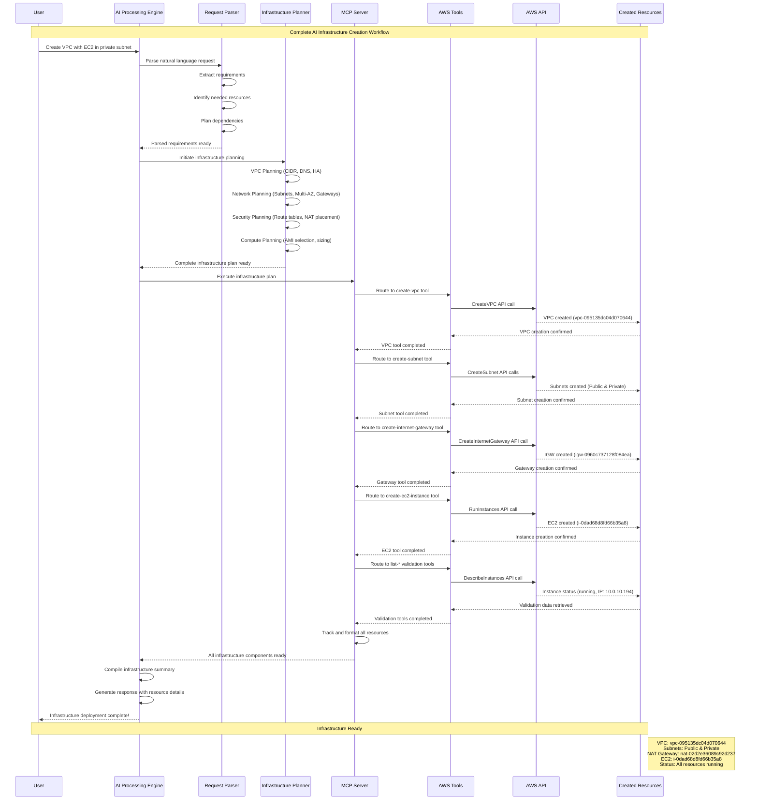
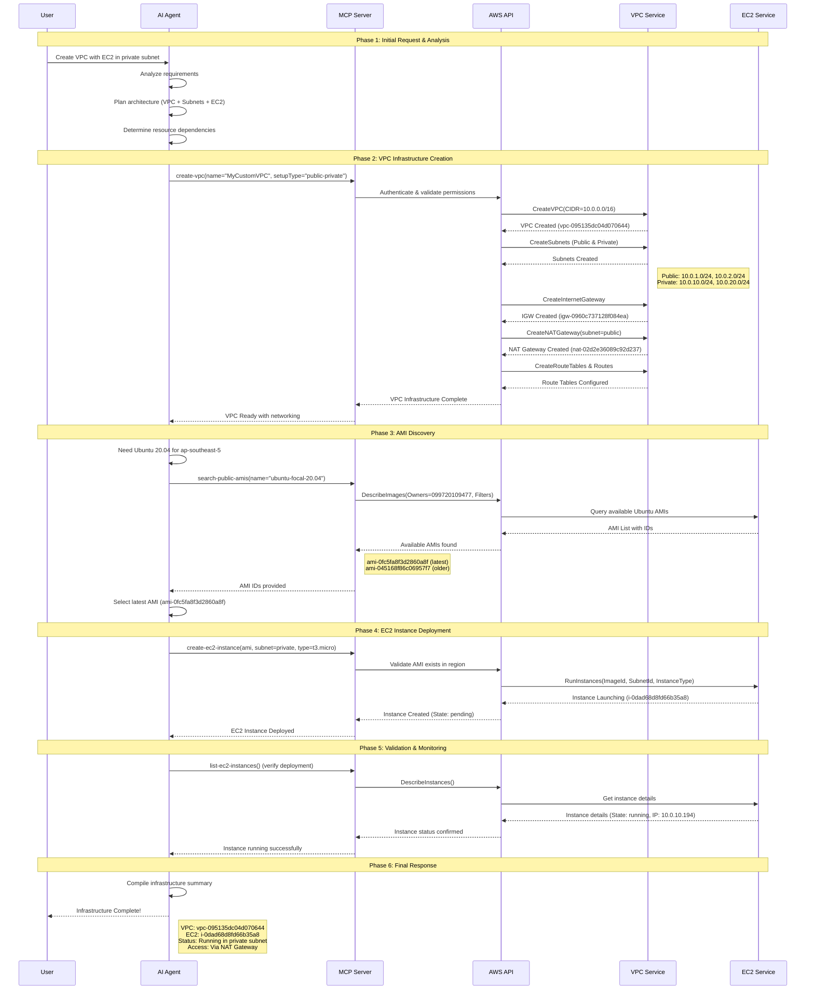

# AI-Driven AWS Infrastructure Creation Flow

## Complete AI Infrastructure Creation Workflow

## Step-by-Step AI Creation Process

## AI Decision Tree for Infrastructure Creation

```mermaid
graph TD
    Start[Start: User Request]
    
    Analyze{Analyze Request}
    
    VPCExists{VPC Exists?}
    CreateVPC[Create VPC<br/>CIDR planning<br/>Multi-AZ setup<br/>DNS configuration]
    
    SubnetNeeds{Subnet Requirements?}
    CreateSubnets[Create Subnets<br/>Public for NAT<br/>Private for EC2<br/>Route tables]
    
    InternetAccess{Internet Access Needed?}
    CreateGateways[Create Gateways<br/>Internet Gateway<br/>NAT Gateway<br/>Route configuration]
    
    AMISelection{AMI Selection}
    SearchAMI[Search Public AMIs<br/>Ubuntu 20.04<br/>Region-specific<br/>Latest version]
    
    EC2Config{EC2 Configuration}
    CreateEC2[Deploy EC2<br/>Instance type<br/>Subnet placement<br/>Security groups]
    
    Validate[Validate Deployment<br/>Check instance state<br/>Verify networking<br/>Confirm connectivity]
    
    Complete[Infrastructure Ready]
    
    Start --> Analyze
    Analyze --> VPCExists
    
    VPCExists -->|No| CreateVPC
    VPCExists -->|Yes| SubnetNeeds
    CreateVPC --> SubnetNeeds
    
    SubnetNeeds -->|Public/Private| CreateSubnets
    SubnetNeeds -->|Existing OK| InternetAccess
    CreateSubnets --> InternetAccess
    
    InternetAccess -->|Yes| CreateGateways
    InternetAccess -->|No| AMISelection
    CreateGateways --> AMISelection
    
    AMISelection --> SearchAMI
    SearchAMI --> EC2Config
    
    EC2Config --> CreateEC2
    CreateEC2 --> Validate
    Validate --> Complete
    
    %% Styling
    classDef decision fill:#fff3e0,stroke:#ff8f00,stroke-width:2px
    classDef action fill:#e8f5e8,stroke:#4caf50,stroke-width:2px
    classDef start fill:#e3f2fd,stroke:#2196f3,stroke-width:3px
    classDef complete fill:#f3e5f5,stroke:#9c27b0,stroke-width:3px
    
    class Start start
    class Complete complete
    class Analyze,VPCExists,SubnetNeeds,InternetAccess,AMISelection,EC2Config decision
    class CreateVPC,CreateSubnets,CreateGateways,SearchAMI,CreateEC2,Validate action
```

## AI Capabilities & Benefits

### 🧠 AI Intelligence Features
- **Requirement Understanding**: Natural language processing of user requests
- **Architecture Planning**: Automatic selection of best practices
- **Dependency Management**: Understanding resource creation order
- **Error Handling**: Intelligent retry and problem resolution
- **Cost Optimization**: Selecting appropriate instance types and configurations

### 🔄 Automation Benefits
- **Speed**: Complete infrastructure in minutes vs hours
- **Consistency**: Standardized deployments every time
- **Best Practices**: Built-in security and networking patterns
- **Error Reduction**: Automated validation and testing
- **Documentation**: Auto-generated infrastructure diagrams

### 📊 What AI Manages Automatically
1. **Network Design**: CIDR block allocation, subnet planning
2. **Security**: Route table configuration, access patterns
3. **High Availability**: Multi-AZ deployment strategies
4. **Resource Discovery**: Finding correct AMIs for regions
5. **Validation**: Ensuring infrastructure works as expected

### 🛠️ Tools AI Uses
| Tool | Purpose | Example |
|------|---------|---------|
| `create-vpc` | VPC foundation | Creates VPC with subnets & gateways |
| `create-ec2-instance` | Compute deployment | Launches instances in correct subnets |
| `list-*` tools | Discovery & validation | Finds AMIs, checks instance status |
| `create-subnets` | Network segmentation | Public/private subnet creation |
| `create-*-gateway` | Internet connectivity | IGW and NAT gateway setup |

This AI-driven approach transforms infrastructure creation from manual, error-prone processes into intelligent, automated workflows that deliver consistent, secure, and optimized cloud environments.
